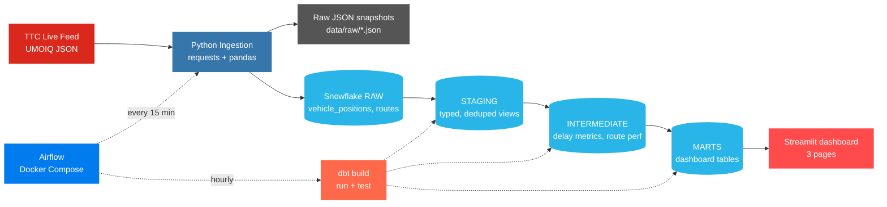

# TTC Transit Analytics Pipeline

🚇 **[Live dashboard → ttc-transit-pipeline.streamlit.app](https://ttc-transit-pipeline.streamlit.app/)**

End-to-end data engineering pipeline that ingests live Toronto TTC vehicle
location data every 15 minutes, lands it in Snowflake, transforms it with dbt
through staging / intermediate / mart layers, and serves a public Streamlit
dashboard that answers commuter-facing questions about route reliability and
delay patterns.

**Built by [Riyasat Zaman](https://github.com/riyasatzaman).** Computing Science
graduate (University of Alberta, June 2026), Statistics minor.

---

## Architecture



---

## Tech stack

| Layer | Tool |
|---|---|
| Language | Python 3.11 (Airflow container) / 3.12 (local dev) |
| Ingestion | `requests`, `pandas`, `snowflake-connector-python` |
| Raw storage | Parquet/JSON files in `data/raw/`, then Snowflake `RAW` schema |
| Orchestration | Apache Airflow 2.8 (LocalExecutor) on Docker Compose |
| Warehouse | Snowflake — `TTC_ANALYTICS` database, four schemas |
| Transformation | `dbt-core` 1.7 + `dbt-snowflake` |
| Dashboard | Streamlit 1.37 + Plotly |
| Testing | `pytest` for ingestion utilities; dbt tests for data quality |
| CI surface | GitHub Actions-ready (no live workflow yet) |

---

## Data source

Two conceptual sources, both pulled from the public UMOIQ / NextBus-style JSON
feed (not a true GTFS-RT protobuf — see *Known limitations*):

- **Live vehicle positions** — `?command=vehicleLocations&a=ttc`
  Per-vehicle records with `id`, `routeTag`, `lat`, `lon`, `speedKmHr`,
  `dirTag`, `secsSinceReport`. ~500–1,000 vehicles per snapshot at peak.
- **Static route reference** — `?command=routeList&a=ttc`
  ~220 routes, each as `(tag, title)` e.g. `("7", "7-Bathurst")`.
  Short / long name split happens in `stg_routes`.

The raw payload is saved as JSON in `data/raw/` for replay/audit before any
Snowflake write — every ingestion run is reproducible from disk.

---

## Folder structure

```
ttc-transit-pipeline/
├── dags/
│   ├── ttc_ingestion_dag.py       # Every 15 min: fetch -> validate -> load
│   └── ttc_dbt_dag.py             # Hourly: dbt staging/intermediate/marts/test
├── ingestion/
│   ├── fetch_vehicle_positions.py # Live feed -> RAW.vehicle_positions
│   ├── fetch_static_gtfs.py       # Route list -> RAW.routes
│   └── utils.py                   # Parsing, Snowflake load, raw-file IO
├── dbt_ttc/
│   ├── dbt_project.yml
│   ├── profiles.yml               # Snowflake conn via env_var()
│   ├── macros/
│   │   └── generate_schema_name.sql
│   ├── models/
│   │   ├── schema.yml             # sources + tests
│   │   ├── staging/
│   │   │   ├── stg_vehicle_positions.sql
│   │   │   └── stg_routes.sql
│   │   ├── intermediate/
│   │   │   ├── int_vehicle_delays.sql
│   │   │   └── int_route_performance.sql
│   │   └── marts/
│   │       ├── mart_route_delay_summary.sql
│   │       ├── mart_hourly_reliability.sql
│   │       └── mart_worst_stops.sql      # disabled — see Known limitations
│   └── tests/
│       ├── assert_no_null_route_ids.sql
│       ├── assert_valid_timestamps.sql
│       └── assert_pct_on_time_in_range.sql
├── dashboard/
│   ├── app.py                     # Landing page
│   ├── pages/
│   │   ├── 1_Route_Reliability.py
│   │   ├── 2_Delay_Heatmap.py
│   │   └── 3_Best_Time_to_Ride.py
│   ├── utils/
│   │   ├── snowflake_connector.py # Cached connection + Decimal->float coerce
│   │   └── ui.py                  # Shared page header, footer, time helpers
│   └── requirements.txt
├── tests/
│   └── test_ingestion.py          # 6 pytest cases on the parser
├── docker-compose.yml             # Postgres + Airflow webserver + scheduler
├── Dockerfile                     # Extends apache/airflow with dbt-snowflake
├── requirements.txt
├── conftest.py                    # pytest rootdir anchor
├── .env.example
└── .gitignore
```

---

## Snowflake schema

Database: `TTC_ANALYTICS`. Four schemas, one per pipeline layer:

| Schema | Type | Object | Materialization |
|---|---|---|---|
| `RAW` | source | `vehicle_positions` | append-only table |
| `RAW` | source | `routes` | append-only table |
| `STAGING` | dbt | `stg_vehicle_positions` | view |
| `STAGING` | dbt | `stg_routes` | view |
| `INTERMEDIATE` | dbt | `int_vehicle_delays` | view |
| `INTERMEDIATE` | dbt | `int_route_performance` | view |
| `MARTS` | dbt | `mart_route_delay_summary` | table |
| `MARTS` | dbt | `mart_hourly_reliability` | table |

`RAW` is append-only by design (every ingestion writes new rows). Deduplication
and type casting happen in `STAGING` via the `qualify row_number()` pattern.
`MARTS` are materialized as tables so the dashboard's queries are fast and
stable between dbt runs.

---

## Airflow DAGs

Two DAGs run locally via Docker Compose. Both start paused-on-creation so the
first run is always manual.

| DAG | File | Schedule | Tasks |
|---|---|---|---|
| `ttc_ingestion_dag` | `dags/ttc_ingestion_dag.py` | `*/15 * * * *` | `fetch_and_save → validate → load_to_snowflake` |
| `ttc_dbt_dag` | `dags/ttc_dbt_dag.py` | `0 * * * *` | `dbt_run_staging → dbt_run_intermediate → dbt_run_marts → dbt_test` |

The ingestion DAG uses Airflow's TaskFlow API (`@task`) and passes a small XCom
metadata dict between tasks (raw file path + ingest timestamp) — each task
re-reads the raw JSON from disk so any task is independently retryable.

The dbt DAG uses `BashOperator` and runs each dbt layer as its own task so
failures show up at the layer they happen at, not in a single monolithic
`dbt build`.

---

## dbt models

### Staging (`STAGING` schema, views)

- **`stg_vehicle_positions`** — casts types, drops rows missing required keys,
  dedupes by `(vehicle_id, recorded_at)` keeping the latest ingestion.
- **`stg_routes`** — collapses append-only `RAW.routes` to one row per route
  (latest snapshot wins) and splits the feed's `"7-Bathurst"` string into
  `route_short_name` (`"7"`) and `route_long_name` (`"Bathurst"`).

### Intermediate (`INTERMEDIATE` schema, views)

- **`int_vehicle_delays`** — per-observation enrichment: route name joined
  from `stg_routes`, hour / day-of-week derived from `recorded_at`, per-vehicle
  LAG signal, plus a `secs_since_report`-based `is_delayed` boolean and
  continuous `delay_proxy_seconds` (`max(0, secs_since_report - 120)`).
- **`int_route_performance`** — aggregates `int_vehicle_delays` to
  route × direction × hour × day-of-week with `total_observations`,
  `pct_on_time`, `pct_delayed`, and average speed / delay metrics.

### Marts (`MARTS` schema, tables)

- **`mart_route_delay_summary`** — one row per route. Drives the leaderboard.
- **`mart_hourly_reliability`** — route × hour × day-of-week. Drives the
  heatmap and best-time-to-ride pages.
- **`mart_worst_stops`** — *intentionally disabled.* Requires static GTFS
  stops / trips / stop_times we haven't ingested. The file is kept as a
  documented stub rather than silently dropped — see *Future improvements*.

---

## Data quality

**Built-in dbt tests (declared in `dbt_ttc/models/schema.yml`):**

- `not_null` on every source key (`vehicle_id`, `route_id`, `_ingested_at`)
- `unique` on `stg_routes.route_id`, `mart_route_delay_summary.route_id`
- `relationships` from `stg_vehicle_positions.route_id` → `stg_routes.route_id`
  (catches orphan route IDs)

**Custom singular tests (`dbt_ttc/tests/`):**

- `assert_no_null_route_ids.sql` — staging contract
- `assert_valid_timestamps.sql` — catches future / pre-2020 `recorded_at`
  values. Compares in UTC explicitly because Snowflake's `current_timestamp()`
  is `TIMESTAMP_LTZ` (session-local) and our stored values are
  `TIMESTAMP_NTZ` (UTC) — naive comparisons would flag every recent row.
- `assert_pct_on_time_in_range.sql` — cross-mart sanity check that
  `pct_on_time ∈ [0, 100]`.

**Python tests (`tests/test_ingestion.py`):** 6 pytest cases on the parser
(happy path, missing keys, type coercion, dirTag direction parsing, naive
timestamp math).

**Total automated checks: 38 dbt + 6 pytest = 44 passing.**

---

## Dashboard

Three Streamlit pages reading from the `MARTS` schema:

| Page | Question answered | Source mart |
|---|---|---|
| Route Reliability | Which routes are most/least on time? | `mart_route_delay_summary` |
| Delay Heatmap | When during the week is a given route most stressed? | `mart_hourly_reliability` |
| Best Time to Ride | When should I take a route for the smoothest experience? | `mart_hourly_reliability` |

Deployed publicly on **[Streamlit Community Cloud](https://ttc-transit-pipeline.streamlit.app/)**.
Theme pinned to a dark base with TTC red (`#DA291C`) as the accent via
`.streamlit/config.toml`. The Snowflake connector coerces `decimal.Decimal`
columns to `float` on every fetch so pandas quantile / numpy operations
work cleanly.

> 📸 Screenshots: `docs/screenshots/` (add: landing, leaderboard, heatmap,
> best-time-to-ride, Airflow Graph view, Snowflake query result).

---

## Run it locally

### Prerequisites

- Docker Desktop (Apple Silicon supported via `platform: linux/amd64`)
- Python 3.11 or 3.12
- A Snowflake account (a free trial works)
- ~5 GB free disk for the Airflow image

### One-time setup

```bash
git clone https://github.com/riyasatzaman/ttc-transit-pipeline.git
cd ttc-transit-pipeline

# Configure Snowflake credentials
cp .env.example .env
# Edit .env and fill in SNOWFLAKE_ACCOUNT / USER / PASSWORD

# Create the Snowflake database, schemas, and raw tables
# (paste the DDL block from docs/snowflake_setup.sql into a Snowsight worksheet)

# Local Python venv for ingestion + dbt + dashboard
python3.12 -m venv .venv
source .venv/bin/activate
pip install -r requirements.txt
```

### Run the Airflow stack

```bash
# First time only — build the image and create the metadata DB + admin user
docker compose build airflow-webserver
docker compose up airflow-init

# Start the stack
docker compose up -d
open http://localhost:8080      # login admin / admin
```

Trigger `ttc_ingestion_dag` once manually from the UI to verify the end-to-end
flow, then unpause it so the schedule takes over.

### Run dbt manually (also runs hourly inside Airflow)

```bash
export DBT_PROFILES_DIR="$(pwd)/dbt_ttc"
dotenv run -- dbt build --project-dir dbt_ttc
```

`dbt build` runs every model and every test in dependency order. Expect ~38
tests to pass.

### Launch the dashboard

```bash
streamlit run dashboard/app.py
# -> http://localhost:8501
```

### Run the Python tests

```bash
pytest tests/ -v
```

---

## Configuration

Everything Snowflake-related is environment-driven. `.env.example` documents
the variables; the real `.env` is gitignored.

| Variable | Purpose |
|---|---|
| `SNOWFLAKE_ACCOUNT` | Account locator (the part before `.us-west-2.aws`) |
| `SNOWFLAKE_USER` | User |
| `SNOWFLAKE_PASSWORD` | Password (rotate if ever exposed) |
| `SNOWFLAKE_ROLE` | Default: `ACCOUNTADMIN` |
| `SNOWFLAKE_WAREHOUSE` | Default: `COMPUTE_WH` |
| `SNOWFLAKE_DATABASE` | Default: `TTC_ANALYTICS` |
| `SNOWFLAKE_SCHEMA` | Default: `RAW` (ingestion); dbt switches per layer |
| `TTC_VEHICLE_FEED_URL` | Override if the feed URL ever changes |
| `AIRFLOW_UID` | Leave at `50000` — overriding to host uid breaks Python's user site-packages inside the container |

`dbt_ttc/profiles.yml` reads these same variables via `env_var()`, so the same
`.env` works for ingestion, dbt, and the dashboard.

---

## Known limitations

- **Headway approximation**, not true schedule adherence. The UMOIQ vehicle
  location feed gives positions, not stop arrivals. Computing real
  schedule-vs-actual deltas would require ingesting static GTFS
  (`stops`, `trips`, `stop_times`, `calendar`) and doing a spatial join from
  vehicle positions to nearest stop. `mart_worst_stops` is left as a
  documented stub so the intent is visible.
- **Delay metric is a proxy.** `is_delayed = secs_since_report > 120` flags
  vehicles offline / not pinging the feed for more than 2 minutes. For busy
  routes this is rare, which is why the dashboard's Delay Heatmap and
  Best Time to Ride pages use the more variable `avg_secs_since_report`
  rather than the floored `avg_delay_proxy_seconds`.
- **Airflow is local-only.** A real deployment would use Astronomer, MWAA, or
  Cloud Composer plus secrets management instead of a `.env` file.
- **No incremental dbt.** Marts are full-rebuild every hour. Fine at this
  scale (~50k rows/day) but the obvious next optimization.
- **No backfill of historical data.** The pipeline only knows about what it
  has ingested since the first DAG run.

---

## Future improvements

In rough priority order:

1. **Schedule adherence** — ingest static GTFS, spatial-join positions to
   nearest stop, compute per-stop arrival deltas. Unlocks
   `mart_worst_stops` honestly.
2. **Incremental dbt models** — `materialized='incremental'` on staging and
   intermediate, partitioned by `_ingested_at` date. Cuts Snowflake compute.
3. **Deploy Airflow** to Astronomer / MWAA. Move secrets to Airflow
   Connections rather than `.env`.
4. **CI** — GitHub Actions running `pytest` + `dbt build --select state:modified`
   on every PR.
5. **Observability** — Slack alerts on DAG failures, simple `dbt source
   freshness` check on `RAW.vehicle_positions`.
6. **Geospatial layer** — Mapbox / pydeck route map showing live vehicle
   positions and slow segments.

---

## Resume bullets

- Built an end-to-end transit analytics pipeline using **Apache Airflow,
  dbt, Snowflake, and Streamlit** that ingests live TTC vehicle location
  data every 15 minutes, transforms it through raw / staging / intermediate /
  mart layers, and powers a three-page analytics dashboard.
- Orchestrated Python ingestion and dbt transformation workflows on
  Airflow + Docker Compose with retries, validation tasks, and per-layer
  failure isolation across two scheduled DAGs.
- Designed Snowflake warehouse schemas and 6 dbt models with **38 automated
  data-quality tests** (built-in `not_null` / `unique` / `relationships` plus
  custom singular tests for null route IDs, timezone-correct timestamps, and
  cross-mart `pct_on_time` range checks).
- Implemented and **publicly deployed** a Streamlit dashboard backed by
  Snowflake mart tables that surfaces route reliability, delay heatmaps, and
  best-time-to-ride recommendations for ~200 TTC routes
  ([live demo](https://ttc-transit-pipeline.streamlit.app/)).

---

## Interview talking points

**“Walk me through the architecture.”** A Python ingestion script triggered by
an Airflow DAG hits the live TTC vehicle feed every 15 minutes, saves the raw
JSON snapshot to disk for replay, and appends parsed records into
Snowflake's `RAW` schema. A second Airflow DAG runs dbt hourly through four
sequential tasks — staging, intermediate, marts, and tests — so any layer's
failure is visible in the Airflow Graph view. The marts are materialized as
tables that a three-page Streamlit dashboard queries directly.

**“Why Airflow?”** Production-style orchestration with a UI, retries, task
isolation, and a real DAG graph instead of cron + bash. Splitting the dbt
build into per-layer BashOperator tasks gives me granular failure visibility
in the same UI.

**“Why dbt?”** Version-controlled, testable SQL with lineage. The
relationships test between `stg_vehicle_positions.route_id` and
`stg_routes.route_id` was caught by a 30-second `dbt test`, not by a
broken dashboard query at 3 AM.

**“Why Snowflake?”** Separate storage and compute, native multi-schema, and
first-class dbt support. Realistic cloud warehouse layer rather than just
Postgres-in-Docker.

**“What's the most interesting bug you hit?”** A dbt test
(`assert_valid_timestamps`) flagged 26,491 "future" timestamps that weren't
actually wrong — `recorded_at` is `TIMESTAMP_NTZ` stored as UTC, but Snowflake's
`current_timestamp()` returns `TIMESTAMP_LTZ` in the session timezone (default
US/Pacific). The naive comparison treated UTC values as PST and flagged
everything within the last 7 hours. Fixed it with
`convert_timezone('UTC', current_timestamp())::timestamp_ntz`.

**“What would you do in production?”** Deploy Airflow to a managed service,
move credentials from `.env` to Airflow Connections + a secrets backend,
switch intermediate / mart models to incremental, add a CI step that runs
`dbt build --select state:modified` on PRs, and wire `dbt source freshness`
into an alerting channel.
